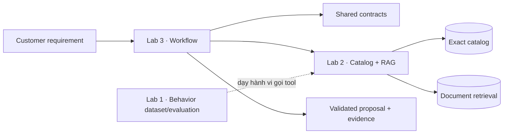
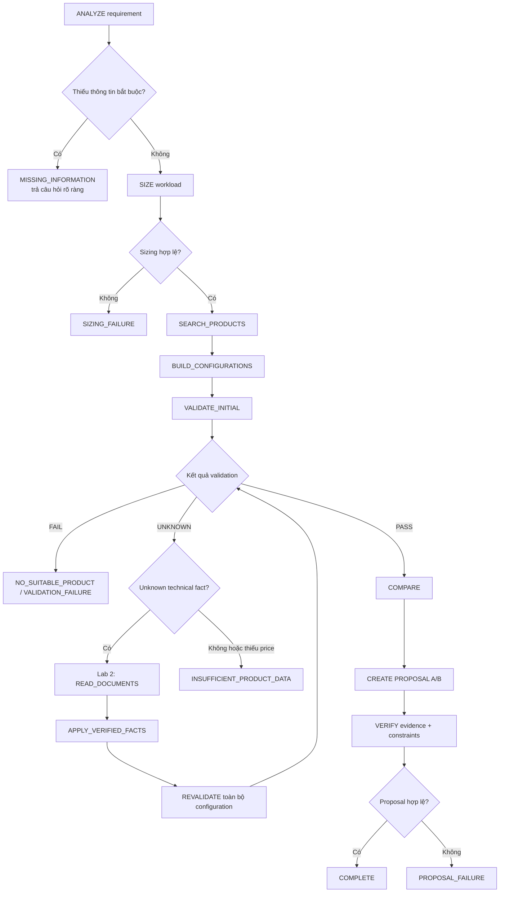
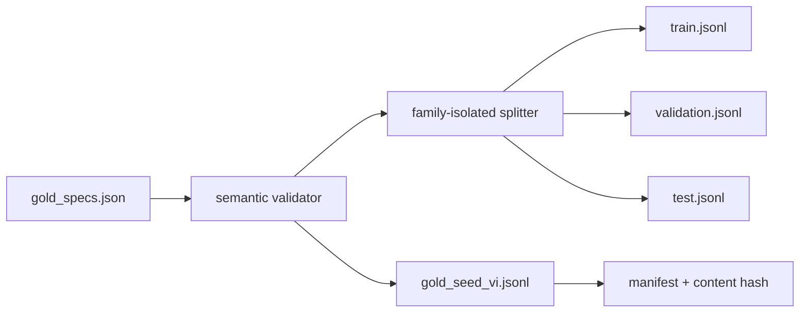

# Lab Demo · Tư vấn cấu hình AI on-prem

> Một nền tảng minh bạch để tư vấn AI Server và AI Workstation: biết gì nói đó,
> thiếu gì hỏi đó, giá chưa chắc thì không tự bịa, và mọi kết luận quan trọng đều
> phải lần được về contract hoặc evidence.


## 1. Dự án này làm gì?

`lab-demo` là nền tảng foundation cho một trợ lý tư vấn hạ tầng AI chạy on-prem.
Người dùng đưa vào nhu cầu như mô hình, VRAM, RAM, storage, workload và ngân sách;
hệ thống đi qua sizing, catalog, cấu hình cụ thể, validation, evidence và proposal.

Điểm quan trọng nhất của dự án không phải là “trả lời nghe có vẻ hợp lý”, mà là
giữ được đường đi có thể kiểm tra:

- Không biến dữ liệu thiếu thành giá trị mặc định.
- Không suy diễn giá option RAM/storage từ một cờ giá cấp product.
- Không coi một proposal là hợp lệ chỉ vì `configuration_id` trùng nhau.
- Không claim dataset đã human-review khi manual review chưa hoàn tất.
- Không để caller tự khai `COMPLETE` và một tổng giá tùy ý nếu thiếu `PriceBreakdown`.

## 2. Bức tranh lớn: ba lab, một nền tảng



### Lab 1 — dạy hành vi, không nhồi catalog

Lab 1 tập trung vào cách model/agent hành xử:

- nhận diện intent;
- trích xuất requirement;
- hỏi lại khi thiếu thông tin bắt buộc;
- chọn tool và truyền argument đúng schema;
- đọc `ToolResult`;
- phân biệt fact đã biết, fact chưa biết và claim cần evidence;
- từ chối suy đoán thay vì tự điền số.

Dataset vàng là **behavior dataset tiếng Việt**, không phải database catalog. Các
product, giá và tool result trong seed dùng ID `DEMO-*` hư cấu để kiểm tra hành vi
mà không biến catalog thật thành kiến thức bị ghi nhớ trong model.

### Lab 2 — exact catalog và RAG tách biệt

Lab 2 có hai mặt phẳng dữ liệu:

| Mặt phẳng | Nhiệm vụ | Nguyên tắc |
|---|---|---|
| Exact catalog | product, GPU, RAM, storage, price, availability, numeric filter | authoritative cho fact có cấu trúc |
| Document/RAG | chunk, dense+sparse retrieval, rerank, document evidence | authoritative cho thông tin trong tài liệu |

RAG không được tự ghi đè exact catalog fact. Khi chạy foundation, adapter là
fake/in-memory và deterministic; PostgreSQL, Qdrant, Docling, BGE-M3, reranker,
vLLM và OpenClaw runtime thật vẫn là các adapter tương lai.

### Lab 3 — biến nhu cầu thành cấu hình có thể kiểm chứng

Lab 3 sở hữu business flow:

`requirement → sizing → candidate configurations → validation → fact resolution →
revalidation → comparison → proposal → evidence verification`.

Workflow stateless: nếu thiếu thông tin bắt buộc, run hiện tại trả về câu hỏi;
caller gửi requirement đầy đủ hơn ở lần chạy tiếp theo.

## 3. Luồng chạy đầy đủ của Lab 3



### 3.1. Happy path

1. Requirement có đủ model size, usage và các trường cần thiết.
2. Sizing service tính nhu cầu VRAM/RAM/storage theo rule rõ ràng.
3. Catalog trả product phù hợp.
4. Configuration builder chọn GPU/RAM/storage option **thật**.
5. Validator kiểm platform limit, option compatibility và budget.
6. Hai configuration tốt nhất được compare.
7. Proposal tạo Option A/B, claim kỹ thuật và evidence.
8. Verifier kiểm canonical configuration, derived claim, evidence và budget trước
   khi workflow đi tới `COMPLETE`.

### 3.2. Thiếu thông tin đầu vào

Nếu customer chưa đưa đủ trường bắt buộc, workflow dừng ở
`MISSING_INFORMATION`. Nó không tự đoán budget, storage hay workload. Câu hỏi trả
ra phải nói rõ trường nào còn thiếu để caller bổ sung ở run sau.

### 3.3. Fact kỹ thuật chưa biết → RAG → revalidate

Khi validator gặp một technical fact chưa biết, Lab 3 chỉ cho phép resolver xử lý
fact kỹ thuật có thể tìm trong tài liệu. Resolver phải kiểm tra:

- đúng `product_id`;
- đúng `field_name`;
- đúng value;
- có document/chunk metadata;
- `verified=true`.

Sau khi áp dụng fact đã xác minh, **toàn bộ configuration được revalidate**. Một
document hit mơ hồ không đủ quyền biến `UNKNOWN` thành `PASS`.

### 3.4. Giá chưa đủ không được “cứu” bằng RAG tùy tiện

Giá có ba trạng thái:

| Trạng thái | Ý nghĩa | Budget |
|---|---|---|
| `COMPLETE` | đủ mọi component trong `PriceBreakdown`, tổng khớp component sum | có thể PASS/FAIL |
| `PARTIAL` | biết một phần, còn component thiếu | `UNKNOWN` |
| `UNKNOWN` | chưa có giá đáng tin | `UNKNOWN` |

`PriceBreakdown` là nguồn canonical cho status, total, priced components và missing
components. `ProductConfiguration` không cho caller khai giá có ý nghĩa nếu thiếu
breakdown; proposal verifier cũng kiểm trực tiếp breakdown trước khi so ngân sách.

## 4. Cấu trúc repository

```text
/
├── lab1_finetune/                  # dataset, training/evaluation skeleton
│   ├── data/
│   │   ├── gold_specs.json         # source authoring chuẩn
│   │   ├── seed/gold_seed_vi.jsonl # generated gold seed
│   │   ├── splits/                 # train/validation/test theo family
│   │   └── manifests/              # hash, count, split và provenance
│   ├── evaluation/
│   └── tests/
├── lab2_rag_agent/                 # catalog, retrieval và domain tools
├── lab3_workflow/                  # sizing, config, validation, proposal
├── shared/                         # Pydantic contracts và tool registry
├── adapters/                       # fake/real boundary
├── data/                           # dữ liệu cấp repository nếu có
├── docs/                           # kiến trúc, quyết định, hướng dẫn từng lab
├── README.md                       # README mặc định
├── README.vi.md                    # tài liệu tiếng Việt đầy đủ này
└── pyproject.toml                  # package, dependency và test/lint config
```

### Ranh giới ownership

| Package | Chịu trách nhiệm | Không nên làm |
|---|---|---|
| `lab1_finetune` | behavior dataset, split, exporter, evaluator, training entry points | sở hữu catalog fact thật |
| `lab2_rag_agent` | catalog repository, document retrieval, rerank, domain tools | chứa business flow của Lab 3 |
| `lab3_workflow` | requirement, sizing, config, validation, proposal, orchestration | tự định nghĩa lại shared contract |
| `shared` | models, enums, interfaces, tool args/results | chứa flow riêng của một lab |
| `adapters` | fake/real implementation boundary | làm rò hạ tầng vào domain model |

## 5. Dataset Lab 1

### Quy mô và split

- 60 mẫu tiếng Việt.
- 25 `scenario_family_id`.
- 50 core utterances + 10 multi-tool trajectories.
- Split theo family với seed 42: 46 train / 8 validation / 6 test.
- Không cho một family xuất hiện ở nhiều split để tránh leakage.
- Provenance hiện tại là `synthetic_curated_unreviewed`; manual review 60 mẫu vẫn
  là việc mở, chưa được claim là đã hoàn tất.

### Pipeline tái tạo artifact



Chạy lại pipeline:

```powershell
python -m lab1_finetune.data.build_artifacts
```

Build phải validate trước khi ghi artifact. Runtime tool schema, Pydantic
tool-args/result contract và dataset validator dùng chung registry để tránh việc
dataset pass nhưng runtime fail.

## 6. Cài đặt nhanh trên Windows

Từ thư mục repo canonical:

```powershell
python --version
python -m venv .venv
.\.venv\Scripts\Activate.ps1
python -m pip install -e ".[dev]"
```

Nếu PowerShell chặn activation, có thể gọi trực tiếp:

```powershell
.\.venv\Scripts\python.exe -m pip install -e ".[dev]"
.\.venv\Scripts\python.exe -m pytest
```

Yêu cầu hiện tại là Python 3.11+. Foundation chỉ dùng dependency nhẹ; không cần
GPU, PyTorch hay dịch vụ cloud để chạy test.

## 7. Các lệnh phát triển và verification

| Lệnh | Mục đích |
|---|---|
| `python -m pytest` | chạy toàn bộ unit/integration contract tests |
| `ruff check .` | kiểm tra lint/import/style |
| `python -m compileall -q .` | kiểm tra syntax/compile |
| `python -m lab1_finetune.data.build_artifacts` | build và validate dataset artifacts |
| `python -m pytest shared/tests` | kiểm tra shared contracts, tool matrix |
| `python -m pytest lab1_finetune/tests` | kiểm tra dataset/evaluation Lab 1 |
| `python -m pytest lab2_rag_agent/tests` | kiểm tra catalog/RAG/tools Lab 2 |
| `python -m pytest lab3_workflow/tests` | kiểm tra workflow/proposal Lab 3 |

Gate đầy đủ trước một commit quan trọng:

```powershell
python -m pip install -e ".[dev]"
python -m pytest
ruff check .
python -m compileall -q .
python -m lab1_finetune.data.build_artifacts
python -m pytest
git diff --check
git status
```

## 8. Các điều không nên làm

- Không đưa catalog thật vào model weights của Lab 1.
- Không dùng giá `0` để che một option chưa xác minh.
- Không dùng `model_copy(update=...)` như một cách bypass contract trong production
  path; verifier vẫn phải kiểm lại canonical state.
- Không biến document semantic hit thành exact catalog fact.
- Không chạy SQL/shell tùy ý qua agent boundary.
- Không xóa linked worktree, reset hard hoặc force push khi chưa có checkpoint và
  xác nhận remote.

## 9. Tình trạng hiện tại và giới hạn

Đã có:

- foundation contracts và interfaces typed bằng Pydantic;
- fake adapters deterministic/offline;
- sizing, configuration, validation, comparison, proposal và evidence;
- unknown → verified document fact → revalidate;
- Vietnamese gold dataset 60 mẫu / 25 family;
- evaluator tính metric từ prediction thật;
- test suite và Ruff gate.

Chưa có:

- model training/merge/benchmark thực tế;
- PostgreSQL, Qdrant, Docling, BGE-M3, reranker, vLLM hay OpenClaw runtime thật;
- catalog/pricing production;
- UI production, MCP production hay cloud deployment;
- dataset production khoảng 3.000 mẫu.

## 10. Tài liệu liên quan

- [Kiến trúc](docs/architecture.md)
- [Trạng thái hiện tại](docs/current-state.md)
- [Quyết định còn mở](docs/open-decisions.md)
- [Tổng quan Lab 1](docs/lab1/overview.md)
- [Thiết kế dataset Lab 1](docs/lab1/dataset-design.md)
- [Tổng quan Lab 2](docs/lab2/overview.md)
- [Tổng quan Lab 3](docs/lab3/overview.md)
- [Workflow Lab 3](docs/lab3/workflow.md)
- [Validation Lab 3](docs/lab3/validation.md)

## 11. Quy tắc đóng góp

1. Chọn đúng lab sở hữu thay đổi; contract dùng chung đặt ở `shared/`.
2. Viết regression test cho invariant hoặc flow mới.
3. Chạy full verification gate trước khi commit.
4. Không commit secret, credential, catalog production hay file môi trường cá nhân.
5. Giữ thay đổi nhỏ, commit mô tả đúng mục đích, và không sửa business logic ngoài
   phạm vi task.

---

**Tinh thần của Lab Demo:** câu trả lời tốt không phải câu trả lời tự tin nhất;
đó là câu trả lời biết rõ mình đang dựa vào contract nào, evidence nào, và khi nào
cần nói: “chưa đủ dữ liệu để kết luận”.
