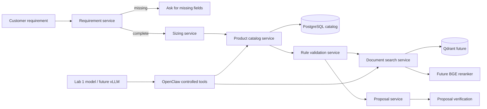

# System architecture

## Dependency direction

`shared/contracts` depends only on Pydantic. `shared/interfaces` defines
protocols. `services` depend on contracts and interfaces. Adapters implement
interfaces. The workflow depends on services and interfaces, never on a
database client or model SDK. Lab 1 owns training concerns; Lab 2 owns catalog
and retrieval concerns; Lab 3 composes them.

## PostgreSQL versus Qdrant

PostgreSQL is authoritative for product identifiers, SKU, price, availability,
RAM, GPU count, VRAM, storage and other exact filters. Queries such as
`RAM >= 512GB`, `GPU count >= 4` and `price <= X` must remain numeric filters.

Qdrant is reserved for technical-document chunks and semantic/hybrid retrieval.
The document path may use Docling for ingestion, BGE-M3 for embeddings and a
local reranker. A vector result cannot override an exact catalog fact.

## Runtime placement

The future vLLM endpoint serves the Lab 1 model. OpenClaw is a controlled agent
surface, not a source of unrestricted SQL or arbitrary infrastructure actions.
The first phase runs all business logic with fakes and has no GPU assumption.
