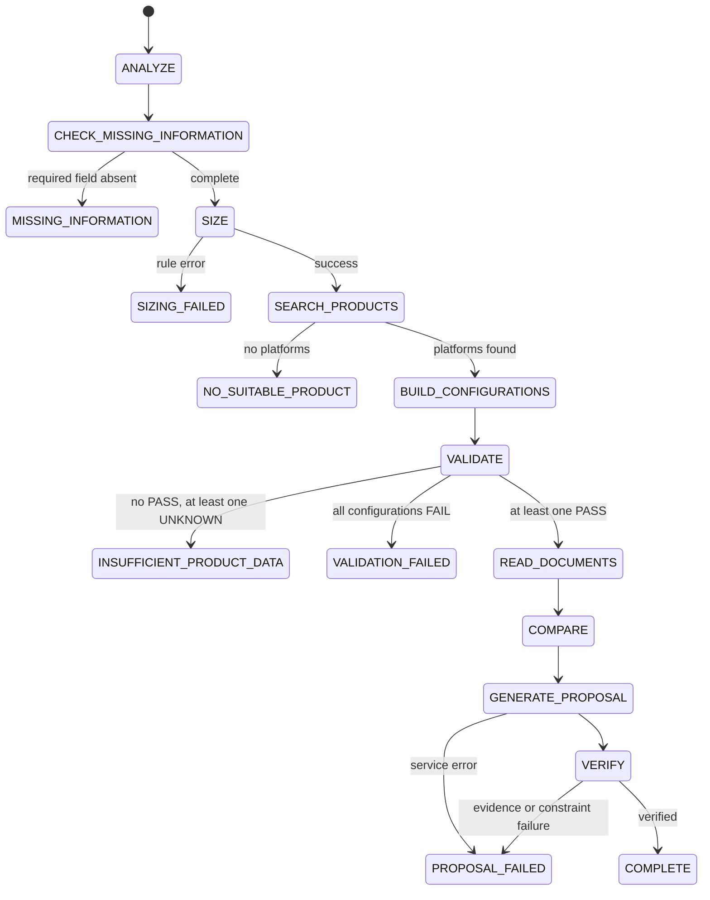

# Lab 3: configuration proposal workflow

Sizing returns resource demand and never chooses a GPU count. Configuration
building calculates GPU count from each actual `GPUOption.memory_gb`. Validation
uses `PASS`, `FAIL` and `UNKNOWN`; unknown data is never converted to zero.

The workflow is stateless in v1. `MISSING_INFORMATION` returns
`missing_fields` plus a question and ends the current run. When the user
answers, the caller creates a new enriched `CustomerRequirement` and starts a
new run. There is no resume-state protocol.

Document search is an injected interface and is called for every passing
configuration before comparison. Proposal generation can emit Option A and
Option B. Verification checks configuration existence, sizing, known budget,
claims and matching verified evidence.
