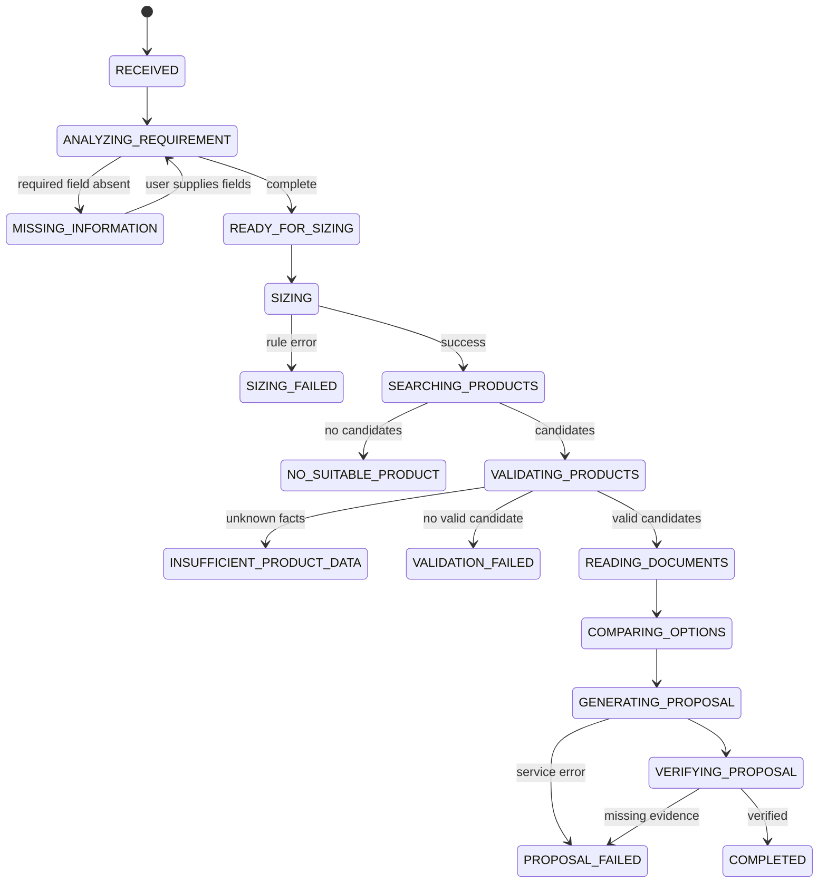

# Lab 3: agentic workflow

Required input is model size, usage (inference/fine-tune) and budget. Optional
input includes concurrent users, context length, storage and expansion. Derived
fields include estimated VRAM, recommended VRAM/RAM and minimum GPU count.

The workflow stops with `MISSING_INFORMATION` before search if a required value
is absent. It never invents a value. Product validation is code-driven and
returns failures, warnings and unknown fields. Proposal verification requires
selected products and sources. The deterministic orchestrator is deliberately
small so a future workflow engine can replace it without changing contracts.
