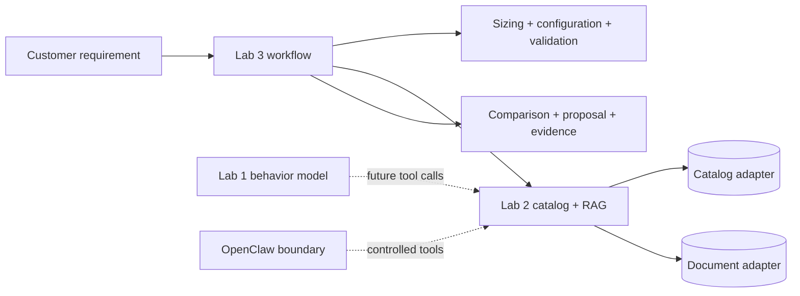

# Kiến trúc

## Ranh giới sở hữu

- `lab1_finetune`: dataset, training entry points và behavior evaluation.
- `lab2_rag_agent`: exact catalog, document retrieval/reranking, RAG và OpenClaw tools.
- `lab3_workflow`: requirement, sizing, concrete configuration, validation, comparison,
  proposal, evidence và workflow state machine.
- `shared`: contracts/interfaces ổn định; không chứa business flow của riêng một lab.
- `adapters/fake` và `adapters/real`: điểm thay thế hạ tầng, không đổi domain API.

PostgreSQL là nguồn authoritative cho fact có cấu trúc và numeric filter. Qdrant
chỉ phục vụ document retrieval; semantic hit không được ghi đè exact catalog fact.
OpenClaw chỉ gọi domain tools, không nhận quyền SQL hay shell tùy ý.

## Luồng phụ thuộc

Contracts không phụ thuộc implementation. Lab 3 phụ thuộc interfaces và domain
services của Lab 2, không phụ thuộc database/vector SDK. Dữ liệu chưa biết giữ
nguyên `None`/`UNKNOWN`; chỉ `ResolvedProductFact` có evidence khớp product,
field, value và `verified=true` mới được áp dụng rồi revalidate.
