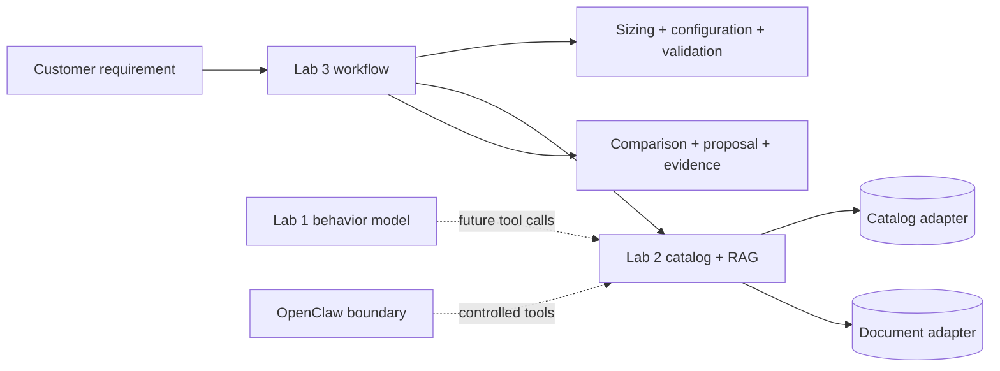

# Kiến trúc

> **Current Lab2 decision (ADR 011):** PostgreSQL owns structured product/catalog
> facts; WeKnora v0.8.0 owns document ingestion and retrieval; OpenClaw sees only
> allow-listed Lab domain tools. The earlier Qdrant/custom-RAG plan is superseded
> for Lab2 by ADR 011. Existing shared contracts remain
> the integration boundary; no WeKnora-specific types belong in `shared`.

```mermaid
flowchart LR
  U[Customer requirement] --> L3[Lab 3 workflow]
  L3 --> S[Sizing + configuration + validation]
  L3 --> L2[Lab 2 catalog + RAG]
  L2 --> C[(Catalog adapter)]
  L2 --> D[(Document adapter)]
  L3 --> P[Comparison + proposal + evidence]
  L1[Lab 1 behavior model] -. future tool calls .-> L2
  OC[OpenClaw boundary] -. controlled tools .-> L2
```

## Ranh giới document evidence → Product

`verified=true` chỉ xác nhận nguồn chứng cứ, không xác nhận kiểu hoặc miền giá trị.
Resolver chỉ áp dụng fact khi document đúng `product_id`, đúng field kỹ thuật đang
cần, có `source_url`, và giá trị đã được chuẩn hóa qua `Product.model_validate`.
Giá trị sai kiểu, âm, boolean hoặc rỗng không được dùng để lấp `UNKNOWN`.

Các document đã verified nhưng đưa ra hai giá trị khác nhau cho cùng một field
sẽ khiến field đó tiếp tục `UNKNOWN`. Retrieval rank chỉ chọn chứng cứ đại diện
khi các giá trị giống nhau; nó không giải quyết mâu thuẫn. Quy tắc chọn nguồn
authoritative vẫn là quyết định mở trong `docs/open-decisions.md`.

## Ranh giới sở hữu

- `lab1_finetune`: dataset, training entry points và behavior evaluation.
- `lab2_rag_agent`: PostgreSQL catalog adapter, WeKnora document-search boundary, and allow-listed agent tools.
- `lab3_workflow`: requirement, sizing, concrete configuration, validation, comparison,
  proposal, evidence và workflow state machine.
- `shared`: contracts/interfaces ổn định; không chứa business flow của riêng một lab.
- `adapters/fake` và `adapters/real`: điểm thay thế hạ tầng, không đổi domain API.

PostgreSQL is authoritative for structured catalog facts and numeric filters.
WeKnora owns document ingestion and retrieval; a document hit is evidence, not an
automatic overwrite of an exact catalog fact. Unknown structured values remain
eligible for later evidence resolution, matching the current in-memory repository
semantics and the required future PostgreSQL parity.
OpenClaw chỉ gọi domain tools, không nhận quyền SQL hay shell tùy ý.

## Luồng phụ thuộc

Contracts không phụ thuộc implementation. Fake implementations dùng chung nằm ở
`adapters/fake`; Lab 2 không phụ thuộc Lab 1 và unit tool tests không phụ thuộc
concrete service của Lab 3. Các tool schema được sinh duy nhất từ Pydantic args
models trong `shared/tool_args.py`; runtime và dataset validator dùng cùng registry.

Dữ liệu chưa biết giữ nguyên `None`/`UNKNOWN`. Product fact resolver chỉ xử lý
technical fact; nó không biến URL bất kỳ thành giá cấu hình. Chỉ
`ResolvedProductFact` có evidence khớp product, field, value và `verified=true`
mới được áp dụng rồi revalidate.
