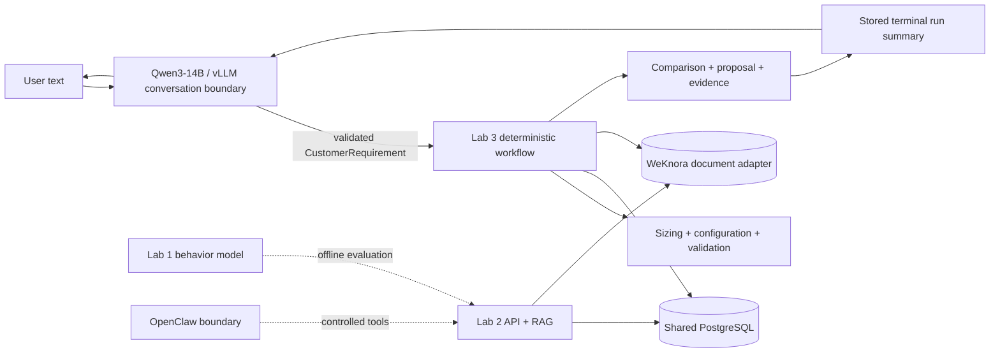

# Kiến trúc

> **Current Lab2 decision (ADR 011):** PostgreSQL owns structured product/catalog
> facts; WeKnora v0.8.0 owns document ingestion and retrieval; OpenClaw sees only
> allow-listed Lab domain tools. The earlier Qdrant/custom-RAG plan is superseded
> for Lab2 by ADR 011. Existing shared contracts remain
> the integration boundary; no WeKnora-specific types belong in `shared`.

```mermaid
flowchart LR
  U[User text] --> Q[Qwen3-14B / vLLM conversation boundary]
  Q -->|validated CustomerRequirement| L3[Lab 3 deterministic workflow]
  L3 --> S[Sizing + configuration + validation]
  L3 --> DB[(Shared PostgreSQL)]
  L3 --> D[(WeKnora document adapter)]
  L2[Lab 2 API + RAG] --> DB
  L2 --> D[(WeKnora document adapter)]
  L3 --> P[Comparison + proposal + evidence]
  P --> R[Stored terminal run summary]
  R --> Q
  Q --> U
  L1[Lab 1 behavior model] -. offline evaluation .-> L2
  OC[OpenClaw boundary] -. controlled tools .-> L2
```

## Lab 3 Phase 3.2: real structured data

Lab 2 and Lab 3 use the same PostgreSQL database and existing `products` catalog.
The database also contains Lab 2's `product_documents` relation and Lab 3's typed
`configuration_options` plus explicit `configuration_option_products` links. Lab 3
reads catalog products through the existing PostgreSQL product repository and
loads compatible GPU/RAM/storage choices through its own option repository. It
does not call the Lab 2 HTTP Tool API. Lab 2's OpenClaw agent continues to use its
controlled domain tools; the new option repository is not an agent tool.

The normal Lab 3 app remains the offline demo. A separate real-data app factory
uses `LAB3_POSTGRES_DSN`, which should point to the same database as
`LAB2_POSTGRES_DSN`, plus the existing `WEKNORA_BASE_URL`, `WEKNORA_API_KEY`, and
`WEKNORA_KNOWLEDGE_BASE_ID`, and `LAB3_LLM_BASE_URL`/`LAB3_LLM_MODEL` with an
optional `LAB3_LLM_API_KEY`. It directly composes the existing PostgreSQL product,
configuration-option, and product-document repositories with
`WeKnoraDocumentSearch`; it does not call Lab 2 HTTP. The real runtime uses a
separate verified fact resolver and closes its owned WeKnora HTTP client during
FastAPI lifespan shutdown. Injected document search clients remain caller-owned.
This is source implementation only, not live provider or database verification.

## Lab 3 real document evidence → Product trust boundary

The offline `DeterministicProductFactResolver` remains available for fixtures with
explicitly tagged `field_name`, `value`, and `verified=true`. The real runtime uses
`VerifiedDocumentProductFactResolver`; a retrieval hit alone is never a verified
fact. The real path requires WeKnora provider identity, the exact knowledge ID in
the configured knowledge base, a persisted `product_documents` mapping with
`provider_parse_status=completed`, matching product IDs, and a non-empty canonical
source URL that exactly matches the hit. It then applies a narrow deterministic
maximum-capacity rule and validates the typed value through the `Product` model.

Only `max_ram_gb`, `max_gpu_slots`, and `max_storage_gb` are in scope. Invalid,
ambiguous, unsupported, or conflicting evidence leaves the field unresolved.
If accepted evidence agrees, the representative is selected by ascending rank,
then stable document ID and chunk ID; provider retrieval score is not a verification
gate. `ResolvedProductFact.verified=true` means the application checked mapped
identity/provenance and its deterministic extraction/domain rules. It is not a
claim that the underlying real-world statement was independently proven.
Confidence uses the neutral default and is not a calibrated probability.

The source bridge is implemented. The operator reports prior live GB300 provider
and tool/workflow round trips verified; this correction's source/local-fixture
tests do not reverify those services or the newly deployed advisor behavior.
Real PostgreSQL integration tests require their dedicated test DSN and are
reported SKIPPED when absent, not PASS.

Lab 2 uses OpenClaw for its agent/tool-use demonstration. Lab 3 does not use
OpenClaw. Its Phase 3.4 source adds a direct Qwen3-14B/vLLM conversation boundary
around the deterministic workflow: Qwen Advisor converses with full history,
returns a natural reply alongside validated cumulative user-established requirements,
and explains safe summaries read from the server-side run store. Assistant text
is context, not automatically authoritative requirement data; explicit user
selection/confirmation/correction can establish a contextual value. No
model-selected products or prices enter the workflow. The server alone decides
submission from required fields and the absence of a validated existing run ID.
Follow-ups carrying that ID never automatically create another run; NEW CHAT
resets it. Messages/replies/explanations share a 4000-character bound. The Next
conversation-only handler allows 135 s; SSE and unrelated rewrites are unchanged.
The workflow state machine remains deterministic and LLM-unaware. The default
Lab 3 app remains an offline demo; only the explicit real-data app owns the model
client and conversation endpoints.

## Ranh giới sở hữu

- `lab1_finetune`: dataset, training entry points và behavior evaluation.
- `lab2_rag_agent`: PostgreSQL catalog adapter, WeKnora document-search boundary, and allow-listed agent tools.
- `lab3_workflow`: requirement, sizing, concrete configuration, validation, comparison,
  proposal, evidence và workflow state machine.
- `shared`: contracts/interfaces ổn định; không chứa business flow của riêng một lab.
- `adapters/fake` và `adapters/real`: điểm thay thế hạ tầng, không đổi domain API.

PostgreSQL is authoritative for structured catalog facts and numeric filters.
WeKnora owns document ingestion and retrieval; a document hit is evidence, not an
automatic overwrite of an exact catalog fact. Unknown structured values remain
eligible for deterministic evidence resolution in both the in-memory demo and the
PostgreSQL-backed Lab 3 runtime.
OpenClaw chỉ gọi domain tools, không nhận quyền SQL hay shell tùy ý.

## Luồng phụ thuộc

Contracts không phụ thuộc implementation. Fake implementations dùng chung nằm ở
`adapters/fake`; Lab 2 không phụ thuộc Lab 1 và unit tool tests không phụ thuộc
concrete service của Lab 3. Các tool schema được sinh duy nhất từ Pydantic args
models trong `shared/tool_args.py`; runtime và dataset validator dùng cùng registry.

Dữ liệu chưa biết giữ nguyên `None`/`UNKNOWN`. Product fact resolver chỉ xử lý
technical fact; nó không biến URL bất kỳ thành giá cấu hình. Chỉ
`ResolvedProductFact` có evidence khớp product, field, value và `verified=true`
mới được áp dụng rồi revalidate.
